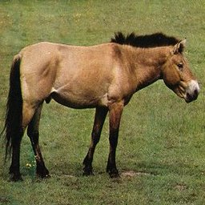
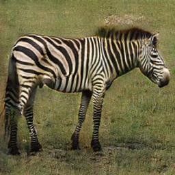
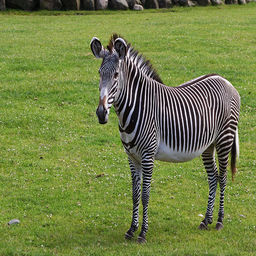
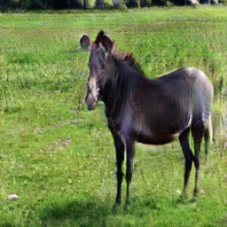

# Image Converter CycleGAN

Lei Mao

University of Chicago

## Introduction

Unlike ordinary pixel-to-pixel translation models, cycle-consistent adversarial networks (CycleGAN) has been proved to be useful for image translations without using paired data. This is a reproduced implementation of CycleGAN for image translations, but it is more compact.


## Dependencies

* Python 3.5
* Numpy 1.14
* TensorFlow 1.8
* ProgressBar2 3.37.1
* OpenCV 3.4


## Files

```
.
├── data
├── demo
├── download.py
├── LICENSE.md
├── model
├── model.py
├── module.py
├── README.md
├── train.py
└── utils.py
```


## Usage

### Download Dataset

Download and unzip specified dataset to designated directories.

```bash
$ python download.py --help
usage: download.py [-h] [--download_dir DOWNLOAD_DIR] [--data_dir DATA_DIR]
                   [--datasets DATASETS [DATASETS ...]]

Download CycleGAN datasets.

optional arguments:
  -h, --help            show this help message and exit
  --download_dir DOWNLOAD_DIR
                        Download directory for zipped data
  --data_dir DATA_DIR   Data directory for unzipped data
  --datasets DATASETS [DATASETS ...]
                        Datasets to download: apple2orange,
                        summer2winter_yosemite, horse2zebra, monet2photo,
                        cezanne2photo, ukiyoe2photo, vangogh2photo, maps,
                        cityscapes, facades, iphone2dslr_flower, ae_photos
```

For example, to download ``apple2orange`` and ``horse2zebra`` datasets to ``download`` directory and extract to ``data`` directory:

```bash
$ python download.py --download_dir ./download --data_dir ./data --datasets apple2orange horse2zebra
```

### Train Model

To have a good conversion capability, the training would take at least 100 epochs, which could take very long time even using a NVIDIA GTX TITAN X graphic card. The model also consumes a lot of graphic card memories. But this could be reduced by reducing the number of convolution filters ``num_filters`` in the model.

```bash
$ python train.py --help
usage: train.py [-h] [--img_A_dir IMG_A_DIR] [--img_B_dir IMG_B_DIR]
                [--model_dir MODEL_DIR] [--model_name MODEL_NAME]
                [--random_seed RANDOM_SEED]
                [--validation_A_dir VALIDATION_A_DIR]
                [--validation_B_dir VALIDATION_B_DIR]
                [--output_dir OUTPUT_DIR]

Train CycleGAN model for datasets.

optional arguments:
  -h, --help            show this help message and exit
  --img_A_dir IMG_A_DIR
                        Directory for A images.
  --img_B_dir IMG_B_DIR
                        Directory for B images.
  --model_dir MODEL_DIR
                        Directory for saving models.
  --model_name MODEL_NAME
                        File name for saving model.
  --random_seed RANDOM_SEED
                        Random seed for model training.
  --validation_A_dir VALIDATION_A_DIR
                        Convert validation A images after each training epoch.
                        If set none, no conversion would be done during the
                        training.
  --validation_B_dir VALIDATION_B_DIR
                        Convert validation B images after each training epoch.
                        If set none, no conversion would be done during the
                        training.
  --output_dir OUTPUT_DIR
                        Output directory for converted validation images.
```

For example, to train CycleGAN model for ``horse2zebra`` dataset:

```bash
$ python train.py --img_A_dir ./data/horse2zebra/trainA --img_B_dir ./data/horse2zebra/trainB --model_dir ./model/horse_zebra --model_name horse_zebra.ckpt --random_seed 0 --validation_A_dir ./data/horse2zebra/testA --validation_B_dir ./data/horse2zebra/testB --output_dir ./validation_output
```
With ``validation_A_dir``, ``validation_B_dir``, and ``output_dir`` set, we could monitor the conversion of validation images after each epoch using our bare eye. 

### Image Conversion

Convert images using pre-trained models.

```bash
$ python convert.py --help
usage: convert.py [-h] [--model_filepath MODEL_FILEPATH] [--img_dir IMG_DIR]
                  [--conversion_direction CONVERSION_DIRECTION]
                  [--output_dir OUTPUT_DIR]

Convert images using pre-trained CycleGAN model.

optional arguments:
  -h, --help            show this help message and exit
  --model_filepath MODEL_FILEPATH
                        File path for the pre-trained model.
  --img_dir IMG_DIR     Directory for the images for conversion.
  --conversion_direction CONVERSION_DIRECTION
                        Conversion direction for CycleGAN. A2B or B2A. The
                        first object in the model file name is A, and the
                        second object in the model file name is B.
  --output_dir OUTPUT_DIR
                        Directory for the converted images.
```

To convert images, put images into ``img_dir`` and run the following commands in the terminal, the converted images would be saved in the ``output_dir``:

```bash
$ python convert.py --model_filepath ./model/horse_zebra/horse_zebra.ckpt --img_dir ./data/horse2zebra/testA --conversion_direction A2B --output_dir ./converted_images
```
The convention for ``conversion_direction`` is first object in the model file name is A, and the second object in the model file name is B. In this case, ``horse = A`` and ``zebra = B``.

## Demo

### Zebra and Horse Conversion

Horse| Horse to Zebra | Zebra | Zebra to Horse |
:-------------------------:|:-------------------------:|:-------------------------:|:-------------------------:
  |   |  |  

## References

* Jun-Yan Zhu, Taesung Park, Phillip Isola, Alexei A. Efros. Unpaired Image-to-Image Translation using Cycle-Consistent Adversarial Networks. 2017.
* Xiaowei Hu's CycleGAN TensorFlow Implementation [Repository](https://github.com/xhujoy)
* Hardik Bansal's CycleGAN TensorFlow Implementation [Repository](https://github.com/hardikbansal)

## To-Do List

- [ ] Create a ``main.py`` file
- [ ] Pre-train more models for different conversions
